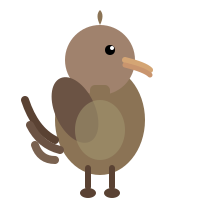

<div align="center">


<p align="center" style="margin-top: 1.5rem;">
  <a href="https://github.com/dsqr/teaser"></a>
  <a href="#"></a>
  <a href="#"></a>
  <a href="#"></a>
</p>

**Composable coming soon landing page components. Built with React, TypeScript, and Tailwind CSS.**

_Install once. Use everywhere. Zero dependencies._

</div>

## ⇁ The Problem

Coming soon pages require repetitive boilerplate:

- Email input validation
- Form state management
- Success/error UI states
- Responsive animations
- Theme consistency

Building from scratch every time wastes time and introduces inconsistency.

## ⇁ The Solution

Teaser provides battle-tested, composable components:

- **Self-contained** - Each component works independently
- **Composable** - Combine them exactly how you need
- **Unstyled** - Use with any design system
- **Themeable** - CSS variables for instant customization
- **No dependencies** - Pure React + Tailwind

## ⇁ Quick Start

```tsx
"use client";

import { useState } from "react";
import {
  Teaser,
  TeaserHeader,
  TeaserTitle,
  TeaserDescription,
  TeaserIcon,
  TeaserForm,
  TeaserInput,
  TeaserButton,
  TeaserSuccess,
  TeaserSuccessIcon,
  TeaserSuccessMessage,
} from "@/components/ui/teaser";

export default function ComingSoon() {
  const [submitted, setSubmitted] = useState(false);

  return (
    <main className="min-h-screen flex items-center justify-center">
      <Teaser>
        <TeaserIcon animated>🚀</TeaserIcon>

        <TeaserHeader>
          <TeaserTitle>Something Amazing</TeaserTitle>
          <TeaserDescription>
            We're building something cool. Be the first to know.
          </TeaserDescription>
        </TeaserHeader>

        {!submitted ? (
          <TeaserForm onEmailSubmit={(email) => setSubmitted(true)}>
            <TeaserInput placeholder="you@example.com" />
            <TeaserButton>Notify Me</TeaserButton>
          </TeaserForm>
        ) : (
          <TeaserSuccess>
            <TeaserSuccessIcon>✨</TeaserSuccessIcon>
            <TeaserSuccessMessage>Thanks for signing up!</TeaserSuccessMessage>
          </TeaserSuccess>
        )}
      </Teaser>
    </main>
  );
}
```

That's it. Deploy it.

## ⇁ Installation

| Package Manager | Command                                                                                                         |
| --------------- | --------------------------------------------------------------------------------------------------------------- |
| bun             | `bunx shadcn-ui@latest add --registry https://raw.githubusercontent.com/dsqr/teaser/master/registry teaser`     |
| npm             | `npx shadcn-ui@latest add --registry https://raw.githubusercontent.com/dsqr/teaser/master/registry teaser`      |
| pnpm            | `pnpm dlx shadcn-ui@latest add --registry https://raw.githubusercontent.com/dsqr/teaser/master/registry teaser` |
| yarn            | `yarn dlx shadcn-ui@latest add --registry https://raw.githubusercontent.com/dsqr/teaser/master/registry teaser` |

This single command installs:

- **teaser.tsx** - All 12 components (Teaser, TeaserIcon, TeaserForm, TeaserButton, TeaserSuccess, etc.)
- **Base components** - Button, Input, Select
- **Utilities** - cn helper and CSS variables
- **Dependencies** - Radix UI, class-variance-authority, tailwind utilities

Everything in one file, just like `shadcn add select`.

## ⇁ API Reference

<details><summary><strong>Teaser Components</strong></summary>

**`<Teaser />`** - Root container

```tsx
<Teaser className="max-w-md">{/* Your content */}</Teaser>
```

**`<TeaserHeader />`** - Wraps title and description

```tsx
<TeaserHeader>
  <TeaserTitle>Coming Soon</TeaserTitle>
  <TeaserDescription>Join our waitlist</TeaserDescription>
</TeaserHeader>
```

**`<TeaserIcon />`** - Icon display with optional animation

Props:
| Prop | Type | Default |
|------|------|---------|
| `animated` | boolean | false |
| `asChild` | boolean | false |

```tsx
<TeaserIcon animated>🚀</TeaserIcon>
<TeaserIcon asChild><RocketIcon /></TeaserIcon>
```

**`<TeaserTitle />`** - Main heading

Props:
| Prop | Type | Default |
|------|------|---------|
| `asChild` | boolean | false |

```tsx
<TeaserTitle>Your Heading</TeaserTitle>
<TeaserTitle asChild><h1>Custom Heading</h1></TeaserTitle>
```

**`<TeaserDescription />`** - Subtitle text

Props:
| Prop | Type | Default |
|------|------|---------|
| `asChild` | boolean | false |

```tsx
<TeaserDescription>Describe your product</TeaserDescription>
```

**`<TeaserContent />`** - Flexible content wrapper

```tsx
<TeaserContent>{/* Custom content */}</TeaserContent>
```

</details>

<details><summary><strong>Form Components</strong></summary>

**`<TeaserForm />`** - Email form with handler

Props:
| Prop | Type | Default |
|------|------|---------|
| `onEmailSubmit` | (email: string) => void | - |

```tsx
<TeaserForm onEmailSubmit={(email) => console.log(email)}>
  <TeaserInput />
  <TeaserButton>Notify Me</TeaserButton>
</TeaserForm>
```

**`<TeaserInput />`** - Pre-configured email input

Auto-validates email. Required field. Default placeholder: "you@example.com"

```tsx
<TeaserInput />
<TeaserInput placeholder="name@company.com" />
```

**`<TeaserButton />`** - Submit button

Props:
| Prop | Type | Default |
|------|------|---------|
| `children` | string | "Notify Me" |

```tsx
<TeaserButton>Get Notified</TeaserButton>
<TeaserButton className="w-full">Subscribe</TeaserButton>
```

</details>

<details><summary><strong>Success State Components</strong></summary>

**`<TeaserSuccess />`** - Success container with fade-in animation

```tsx
<TeaserSuccess>
  <TeaserSuccessIcon>✨</TeaserSuccessIcon>
  <TeaserSuccessMessage>Thanks for joining!</TeaserSuccessMessage>
</TeaserSuccess>
```

**`<TeaserSuccessIcon />`** - Success icon display

Props:
| Prop | Type | Default |
|------|------|---------|
| `asChild` | boolean | false |

```tsx
<TeaserSuccessIcon>✨</TeaserSuccessIcon>
<TeaserSuccessIcon asChild><CheckCircle /></TeaserSuccessIcon>
```

**`<TeaserSuccessMessage />`** - Success text

Props:
| Prop | Type | Default |
|------|------|---------|
| `children` | string | "Thanks! You're on the list." |

```tsx
<TeaserSuccessMessage>Custom success message</TeaserSuccessMessage>
```

</details>

<details><summary><strong>Base Components</strong></summary>

Includes reusable base components for other use cases:

**`Button`** - Flexible button with variants

Variants: `default`, `destructive`, `outline`, `secondary`, `ghost`, `link`

```tsx
import { Button } from '@/components/ui/button'

<Button>Default</Button>
<Button variant="outline">Outline</Button>
<Button variant="ghost" size="sm">Small Ghost</Button>
```

**`Input`** - Standard input field with styling

```tsx
import { Input } from '@/components/ui/input'

<Input type="email" placeholder="Enter email" />
<Input disabled />
```

**`Select`** - Accessible dropdown (Radix UI based)

```tsx
import {
  Select,
  SelectContent,
  SelectItem,
  SelectTrigger,
  SelectValue,
} from "@/components/ui/select";

<Select>
  <SelectTrigger>
    <SelectValue placeholder="Choose option" />
  </SelectTrigger>
  <SelectContent>
    <SelectItem value="option-1">Option 1</SelectItem>
    <SelectItem value="option-2">Option 2</SelectItem>
  </SelectContent>
</Select>;
```

</details>

<details><summary><strong>Theming with CSS Variables</strong></summary>

Customize colors, spacing, and appearance via CSS variables:

```css
:root {
  --background: oklch(1 0 0);
  --foreground: oklch(0.145 0 0);
  --primary: oklch(0.205 0 0);
  --primary-foreground: oklch(0.985 0 0);
  --secondary: oklch(0.97 0 0);
  --secondary-foreground: oklch(0.205 0 0);
  --muted: oklch(0.97 0 0);
  --muted-foreground: oklch(0.556 0 0);
  --border: oklch(0.922 0 0);
  --input: oklch(0.922 0 0);
  --ring: oklch(0.708 0 0);
  --radius: 0.625rem;
}

.dark {
  --background: oklch(0.145 0 0);
  --foreground: oklch(0.985 0 0);
  --primary: oklch(0.985 0 0);
  --primary-foreground: oklch(0.205 0 0);
  /* ...other dark mode variables */
}
```

All components automatically use these variables for consistent theming.

</details>

## ⇁ Testing

Test the registry:

```bash
./scripts/test-registry.sh
```

This creates a temporary project, installs components from the registry, and verifies everything works. Run it after pushing changes to ensure the registry is functional.

Test the kitchen sink locally:

```bash
cd examples/kitchen-sink
npm install
npm run dev
```

## ⇁ Development

Setup with Nix:

```bash
nix develop
```

This provides Bun, Node.js, and development tools across all platforms.

Install dependencies:

```bash
bun install
```

Build package:

```bash
cd packages/teaser
bun run build
```

Run example:

```bash
cd examples/kitchen-sink
npm run dev
```

Format code:

```bash
nix fmt
```

## ⇁ Contributing

Built for learning and experimentation. Open a PR or issue if you want, but no promises - this is a learning project. Feel free to fork it and make it your own!

## ⇁ License

MIT - Do whatever you want with it.
